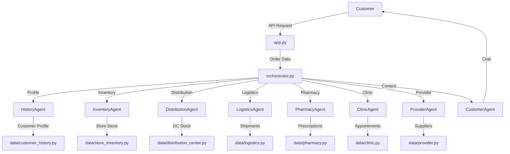
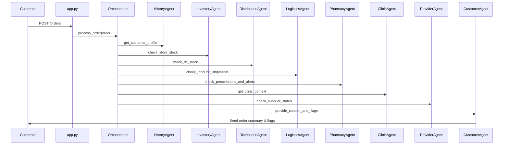

# System Relationship Graphs

This document provides a comprehensive set of Mermaid diagrams to visualize the architecture and flow of the repository. The diagrams cover component dependencies, data flow, agent interactions, parallel execution, and API request flow.

---

## 1. Component Dependency Graph

This graph shows which modules import or depend on which others. Only the main business logic files and their direct dependencies are shown for clarity.

```mermaid
graph TD
    app.py --> agents/orchestrator.py
    app.py --> models.py
    app.py --> agents/customer_agent.py
    app.py --> agents/clinic_agent.py
    app.py --> agents/pharmacy_agent.py
    app.py --> agents/history_agent.py
    app.py --> agents/inventory_agent.py
    app.py --> agents/distribution_agent.py
    app.py --> agents/logistics_agent.py
    app.py --> agents/provider_agent.py

    agents/orchestrator.py --> agents/base.py
    agents/orchestrator.py --> agents/customer_agent.py
    agents/orchestrator.py --> agents/clinic_agent.py
    agents/orchestrator.py --> agents/pharmacy_agent.py
    agents/orchestrator.py --> agents/history_agent.py
    agents/orchestrator.py --> agents/inventory_agent.py
    agents/orchestrator.py --> agents/distribution_agent.py
    agents/orchestrator.py --> agents/logistics_agent.py
    agents/orchestrator.py --> agents/provider_agent.py

    agents/clinic_agent.py --> agents/base.py
    agents/clinic_agent.py --> data/clinic.py

    agents/pharmacy_agent.py --> agents/base.py
    agents/pharmacy_agent.py --> data/pharmacy.py
    agents/pharmacy_agent.py --> utils/auth.py
    agents/pharmacy_agent.py --> utils/phi.py

    agents/history_agent.py --> agents/base.py
    agents/history_agent.py --> data/customer_history.py

    agents/inventory_agent.py --> agents/base.py
    agents/inventory_agent.py --> data/store_inventory.py

    agents/distribution_agent.py --> agents/base.py
    agents/distribution_agent.py --> data/distribution_center.py

    agents/logistics_agent.py --> agents/base.py
    agents/logistics_agent.py --> data/logistics.py

    agents/provider_agent.py --> agents/base.py
    agents/provider_agent.py --> data/provider.py

    app.py --> data/clinic.py
    app.py --> data/pharmacy.py
    app.py --> data/customer_history.py
    app.py --> data/store_inventory.py
    app.py --> data/distribution_center.py
    app.py --> data/logistics.py
    app.py --> data/provider.py
```



**Explanation:**  
- The `app.py` file is the entrypoint and orchestrates requests to all agents and data modules.
- Each agent depends on its respective data module and the base agent class.
- The orchestrator coordinates all agents.

---

## 2. Data Flow Diagram

This diagram shows how data moves through the system when processing an order or a customer chat.



**Explanation:**  
- The orchestrator queries each agent for its domain data.
- Each agent fetches from its data module.
- The orchestrator aggregates context and passes it to the customer-facing agent.
- The customer agent interacts with the customer via chat.

---

## 3. Agent Interaction Sequence Diagram

This sequence diagram illustrates the order and pattern of agent interactions during a typical order placement.



**Explanation:**  
- The orchestrator coordinates agent calls in parallel or sequence as needed.
- Each agent returns its result, which is aggregated for the customer agent.

---

## 4. Parallel Execution Flow Diagram

This diagram shows which agent calls can be executed in parallel during an order pipeline.

```mermaid
flowchart TD
    subgraph Parallel Phase 1
        A1[HistoryAgent]
        A2[InventoryAgent]
        A3[DistributionAgent]
        A4[LogisticsAgent]
        A5[PharmacyAgent]
        A6[ClinicAgent]
        A7[ProviderAgent]
    end
    Parallel Phase 1 --> Aggregator[Orchestrator aggregates context]
    Aggregator --> CustomerAgent
```

**Explanation:**  
- All domain agents can be invoked in parallel for efficiency.
- The orchestrator waits for all to complete, aggregates results, and passes them to the customer agent.

---

## 5. API Request Flow Diagram

This diagram shows the flow of a typical API request (e.g., order placement) through the system.

```mermaid
flowchart LR
    Client[Customer (API Client)]
    Client-->|POST /orders|API[app.py (FastAPI)]
    API-->|Validate & Parse|Models[models.py]
    API-->|Delegate|Orchestrator[orchestrator.py]
    Orchestrator-->|Parallel Calls|Agents[All Domain Agents]
    Agents-->|Fetch Data|DataModules[Data Modules]
    DataModules-->|Results|Agents
    Agents-->|Context|Orchestrator
    Orchestrator-->|Aggregate|CustomerAgent
    CustomerAgent-->|Generate Response|Orchestrator
    Orchestrator-->|Compose API Response|API
    API-->|Return JSON|Client
```

**Explanation:**  
- The API endpoint receives the request, validates input, and delegates to the orchestrator.
- The orchestrator coordinates agent calls, which fetch from data modules.
- The customer agent generates the final customer-facing message.
- The orchestrator composes the full response and returns it to the client.

---

# Summary

- **Component Dependency Graph:** Shows module import relationships.
- **Data Flow Diagram:** Illustrates how data moves through agents and data modules.
- **Agent Interaction Sequence Diagram:** Depicts the order of agent invocations for an order.
- **Parallel Execution Flow:** Highlights which agents run in parallel.
- **API Request Flow:** Shows the end-to-end path of an API request.

These diagrams collectively provide a clear architectural overview of the system's structure and runtime behavior.