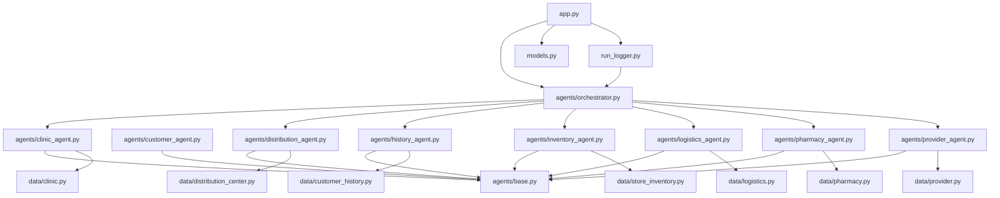
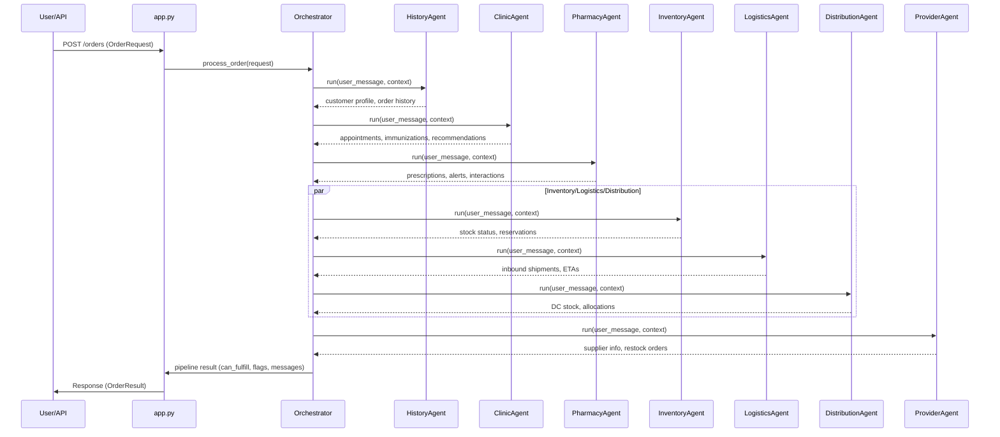
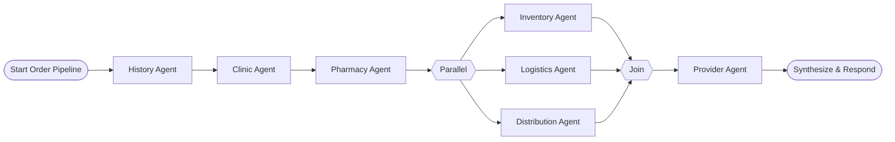

# System Relationship Graphs

This document provides a comprehensive set of Mermaid diagrams visualizing the relationships, data flow, agent orchestration, parallelism, and API request handling for the retail pharmacy agent system.

---

## 1. Component Dependency Graph

This graph shows which modules import or depend on which others, focusing on the main agent and data modules.



**Explanation:**  
- Each agent imports the `base.py` agent class and its relevant data module.
- The orchestrator imports all agents.
- The API (`app.py`) imports the orchestrator, models, and logger.
- Data modules are standalone per domain.

---

## 2. Data Flow Diagram

This diagram shows how data (e.g., order requests, customer info, inventory, etc.) moves through the system from API entry to fulfillment.

```mermaid
flowchart TD
  User([User / API Client])
  API[app.py (FastAPI)]
  Orchestrator[agents/orchestrator.py]
  Agents{{Domain Agents}}
  AgentClinic[Clinic Agent]
  AgentHistory[History Agent]
  AgentInventory[Inventory Agent]
  AgentLogistics[Logistics Agent]
  AgentDistribution[Distribution Agent]
  AgentProvider[Provider Agent]
  AgentPharmacy[Pharmacy Agent]
  DataClinic[data/clinic.py]
  DataHistory[data/customer_history.py]
  DataInventory[data/store_inventory.py]
  DataLogistics[data/logistics.py]
  DataDistribution[data/distribution_center.py]
  DataProvider[data/provider.py]
  DataPharmacy[data/pharmacy.py]
  Logger[run_logger.py]
  Models[models.py]

  User -->|HTTP POST /orders| API
  API -->|OrderRequest| Orchestrator
  Orchestrator -->|Delegates| Agents
  Agents --> AgentClinic
  Agents --> AgentHistory
  Agents --> AgentInventory
  Agents --> AgentLogistics
  Agents --> AgentDistribution
  Agents --> AgentProvider
  Agents --> AgentPharmacy

  AgentClinic --> DataClinic
  AgentHistory --> DataHistory
  AgentInventory --> DataInventory
  AgentLogistics --> DataLogistics
  AgentDistribution --> DataDistribution
  AgentProvider --> DataProvider
  AgentPharmacy --> DataPharmacy

  Orchestrator -->|Pipeline result| Logger
  Logger -->|Log file| (runs/)

  API --> Models
  Models -.-> API
```

**Explanation:**  
- The user sends an order to the API.
- The API parses and validates the request, then passes it to the orchestrator.
- The orchestrator coordinates the domain agents in a pipeline.
- Each agent queries its respective data module.
- Results are aggregated, logged, and returned to the user.

---

## 3. Agent Interaction Sequence Diagram

This sequence diagram illustrates how the orchestrator coordinates the agents for an order, including context passing and tool calls.



**Explanation:**  
- The orchestrator runs agents in a specific order, passing context between them.
- Inventory, logistics, and distribution may run in parallel.
- Provider agent runs after DC/Logistics.
- Results are synthesized and returned.

---

## 4. Parallel Execution Flow Diagram

This diagram shows which agents can execute in parallel and how the pipeline is structured for concurrency.



**Explanation:**  
- After initial context agents (history, clinic, pharmacy), the pipeline fans out to inventory, logistics, and distribution in parallel.
- Results are joined and passed to the provider agent.
- The pipeline then synthesizes the final response.

---

## 5. API Request Flow Diagram

This diagram details the REST API endpoints and their flow through the system.

```mermaid
flowchart TD
  subgraph API Layer
    A1[POST /orders]
    A2[GET /orders/{order_id}]
    A3[POST /chat/start]
    A4[POST /chat/message]
    A5[GET /chat/{customer_id}/history]
    A6[GET /health]
  end

  A1 -->|OrderRequest| Orchestrator
  Orchestrator -->|OrderResult| A1
  A2 -->|Fetch pipeline log| Orchestrator
  Orchestrator -->|OrderResult| A2
  A3 -->|ChatStartRequest| Orchestrator
  Orchestrator -->|Greeting| A3
  A4 -->|ChatMessage| Orchestrator
  Orchestrator -->|ChatResponse| A4
  A5 -->|Get chat log| Orchestrator
  Orchestrator -->|ChatHistory| A5
  A6 -->|Health check| (OK)

  Orchestrator -->|Log| Logger
  Logger -->|Log files| (runs/)
```

**Explanation:**  
- `/orders` endpoints handle order placement and retrieval.
- `/chat` endpoints manage customer chat sessions.
- All business logic routes through the orchestrator, which logs runs.
- `/health` is a simple status endpoint.

---

# Summary

- **Component dependency**: Agents depend on their data modules and the base agent class; orchestrator coordinates all.
- **Data flow**: API → Orchestrator → Agents → Data modules → Logger → API response.
- **Agent sequence**: Context agents first, then parallel stock agents, then provider, then synthesis.
- **Parallelism**: Inventory, logistics, and distribution agents run concurrently.
- **API**: RESTful endpoints for orders and chat, all routed through orchestrator logic.

These diagrams provide a holistic view of the system's structure and runtime behavior.